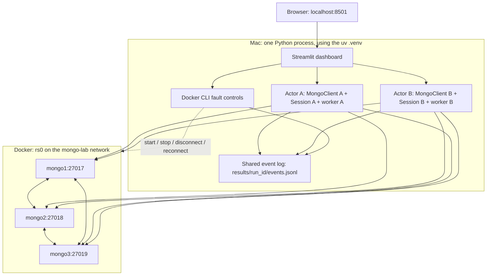

# MongoDB consistency lab

For the current app with **local and three-laptop modes**, use [linked nodes and laptop](linked%20nodes%20and%20laptop/README.md). The files at this repository's root are the older local-only lab.

Three MongoDB 7 containers form replica set `rs0`. A local Streamlit dashboard provides two independent PyMongo clients, A and B. All Python dependencies live in uv's project `.venv`; no global pip installation is needed.

Quick links: [first-time setup](#first-time-setup-on-a-mac) · [launch the app](#everyday-startup-double-click-the-launcher) · [technical architecture](#technical-architecture) · [how the two users are separated](#how-client-a-and-client-b-are-separated) · [experiments](#experiments) · [code map](#code-map).

## First-time setup on a Mac

You need **Docker Desktop** and **uv**. MongoDB runs in Docker; Streamlit and the two clients run in a local `.venv` managed by uv. You do not need to install MongoDB or Python packages globally.

1. Install [Docker Desktop for Mac](https://docs.docker.com/desktop/setup/install/mac-install/). Choose the Apple silicon download for an M-series Mac, or the Intel download for an Intel Mac. Open Docker Desktop and finish its first-launch setup.
2. Install [uv](https://docs.astral.sh/uv/getting-started/installation/), if you do not already have it. In Terminal:

   ```sh
   curl -LsSf https://astral.sh/uv/install.sh | sh
   ```

   Close and reopen Terminal after installation. Verify the tools:

   ```sh
   uv --version
   docker --version
   docker compose version
   ```

   uv can download a compatible Python version when it creates the environment; a separate Python installation is optional.
3. Add the local MongoDB hostnames. Check the existing file first:

   ```sh
   cat /etc/hosts
   ```

   If the following entry is already present, skip this step. Otherwise add it once:

   ```text
   127.0.0.1 mongo1 mongo2 mongo3 # mongo-local-lab
   ```

   ```sh
   echo '127.0.0.1 mongo1 mongo2 mongo3 # mongo-local-lab' | sudo tee -a /etc/hosts
   ```

   Enter your Mac login password when prompted. Terminal does not display characters while you type the password. This lets the Mac-hosted UI resolve the same replica names used inside Docker. The launcher does not edit this system file.
4. Keep the entire project folder together, including `compose.local.yml`, `uv.lock`, `pyproject.toml`, `scripts/`, and `faults/`.

## Everyday startup: double-click the launcher

Double-click **[Start Lab.command](Start%20Lab.command)** in Finder. A `.command` file is a shell script that opens in Terminal on macOS, serving the same purpose as a Windows `.bat` launcher.

It automatically:

1. Finds uv and Docker, including their usual Mac installation locations.
2. Starts Docker Desktop if needed and waits for the engine.
3. Runs `uv sync --locked` to create/update the project `.venv` using `uv.lock`.
4. Runs the existing setup script to start the three containers and initialize/check `rs0`.
5. Starts Streamlit and opens **http://127.0.0.1:8501** in your browser.

Keep the Terminal window open while using the dashboard. The first launch may take several minutes to download dependencies and the MongoDB image; it needs an internet connection. Later launches reuse the installed packages, image, and database volumes. Normal startup preserves your data.

The launcher works even if Terminal starts in another folder, and handles spaces in the project path. It is already executable in this workspace. If a copied/downloaded version opens as text or reports a permission error, run this from the project folder:

```sh
chmod +x "Start Lab.command"
./"Start Lab.command"
```

Run one dashboard instance at a time. If port 8501 is already in use, use the existing dashboard or stop its Terminal process before launching again.

## Manual startup: run each step yourself

Open Terminal and enter the project directory. Type `cd ` (including the space), drag the project folder from Finder into Terminal, then press Return. You should see `compose.local.yml` when you run `ls`.

With Docker Desktop running, execute these commands in order:

   ```sh
   uv sync --locked
   uv run --locked scripts/setup_lab.py
   uv run --locked streamlit run scripts/app.py
   ```

Open **http://127.0.0.1:8501**. The cluster panel should show one **PRIMARY** and two **SECONDARY** nodes; Client A and Client B should both be visible. Run a Write and then a Read as described below to verify the application.

## Shut down and start again

Double-click **[Stop Lab.command](Stop%20Lab.command)** when finished. It stops this project's dashboard and its experiment workers, then removes the `mongo-local-lab` containers and network while preserving the named database volumes and `results/` logs. It leaves unrelated applications/containers and Docker Desktop running. The next **Start Lab.command** recreates the containers using the saved data.

For a complete experiment result, click **Stop experiments** and wait for recovery before using the shutdown file. The shutdown file gives the dashboard 15 seconds to exit, then forcibly stops any remaining matching process; an interrupted trial may have no final result. It also works when the dashboard is already closed. If Docker is unavailable, it reports that container shutdown could not be verified.

If a copied shutdown file is not executable, run `chmod +x "Stop Lab.command"` once. You can also shut down manually:

1. Finish or stop any running experiment and wait for fault recovery.
2. In the Terminal window running Streamlit, press **Ctrl+C** to stop the UI. Closing the browser tab alone does not stop it.
3. From the project folder, stop all three MongoDB containers:

   ```sh
   docker compose -f compose.local.yml stop
   docker compose -f compose.local.yml ps -a
   ```

   Their status should show `Exited`. This keeps the containers and database volumes. You can then quit Docker Desktop if desired.
4. Next time, double-click **Start Lab.command** again to start the whole application. To start only the existing database containers, use `docker compose -f compose.local.yml start`.

Stopping the Streamlit Terminal process does **not** automatically stop MongoDB. The dashboard's **Clear MongoDB data** button is for permanent data deletion, not normal shutdown.

## Startup troubleshooting

- **Docker command or Compose unavailable:** install/open Docker Desktop and complete its setup. The launcher supports the usual user-local and Homebrew paths.
- **Docker engine does not start:** open Docker Desktop manually, wait until it reports that the engine is running, then launch again.
- **Hostname error for mongo1/mongo2/mongo3:** complete the `/etc/hosts` step above.
- **A node remains isolated from an earlier experiment:** run `uv run faults/control.py restore`, then launch again.
- **Port 8501 is occupied:** stop the existing Streamlit process with Ctrl+C, or use that running dashboard.
- **The launcher stops with an error:** read the Terminal output. It stops at the failed step; it does not delete volumes to recover.
- **UI still uses code from before an update:** stop Streamlit with Ctrl+C and relaunch to load fresh modules.

## What database setup does

The setup script initializes a new set or migrates the original `mongo2:27017` / `mongo3:27017` addresses one member at a time. Published and internal ports now match: mongo1=27017, mongo2=27018, mongo3=27019. Containers resolve names through Docker; your Mac resolves the same names through `/etc/hosts`. Setup retains named volumes, checks quorum between changes, and never uses forced reconfiguration. If a custom or unhealthy existing set is detected, it stops. Do not use `docker compose down -v` unless you intend to delete the database.

## Technical architecture

### What runs where

There are **three Docker containers, not five**. The database servers run in containers; the two simulated users run as independent Python objects inside the same Streamlit process on your Mac.



The arrows show possible communication, not a broadcast of every query. PyMongo selects an eligible server for each operation. Any eligible member can become primary after an election; `mongo1` is a name, not a permanently assigned primary role.

| Component | Location | Responsibility |
| --- | --- | --- |
| Browser | Mac | Displays Streamlit controls and results; it does not connect directly to MongoDB. |
| Streamlit + PyMongo | Mac, project `.venv` | Runs the two clients, schedules operations, checks histories, and writes logs. |
| `mongo1`, `mongo2`, `mongo3` | Three Docker containers | Separate `mongod` processes storing replicas of the same database. |
| `mongo-lab` | Docker network | Allows replica members to discover and communicate with each other. |
| Three named volumes | Docker-managed storage | Keep each member's `/data/db` across container stops/restarts. |
| `results/` | Project folder on the Mac | Stores experiment evidence independently of database volumes. |

This is **replication**, not sharding: the nodes maintain copies of the same dataset rather than dividing it into three disjoint datasets. MongoDB is pinned to `mongo:7.0.40` in Compose; the Python dependency versions are locked in `uv.lock`.

### How Client A and Client B are separated

In `Dashboard.__init__()`, the app creates two `Actor` instances:

```python
self.actors = [Actor("A", self.log), Actor("B", self.log)]
```

An `Actor` represents one simulated application user. Each actor owns the following state:

| State | How it separates the clients |
| --- | --- |
| `MongoClient` | A separate driver instance with its own connection pools and topology tracking. A MongoClient can use multiple sockets; it is not one fixed TCP connection. |
| `ClientSession` | A separate logical session ID and operation history, created on the first valid operation or by Reset Session. |
| `Settings` supplied for each operation | Independent read concern, write concern, routing, and causal-mode choices from that client's panel. |
| One-worker executor and lock | A's operations are sequential within A, and B's within B. A and B can execute concurrently without concurrently sharing a session. |
| Client label and sequence counter | Logs identify which client issued each operation and its position in that client's sequence. |

**A and B are simulated users, not authenticated MongoDB accounts.** This lab does not configure authentication, per-user permissions, or separate databases for them. Both can access the same collection and documents. Their separation is about independent application histories, not access control or data ownership.

For example, suppose both panels use `lab.manual`:

1. A inserts `{"_id":"demo","version":1}`. A's successful operation advances A's session metadata.
2. B reads `{"_id":"demo"}` using B's own session and settings. B may see A's data through the database, but does not automatically inherit A's session dependency just because its Read button was clicked later.
3. A reads the document using A's original session. With causal mode and majority read/write concerns, this read participates in A's read-your-writes guarantee. That guarantee does not automatically extend to an unrelated B session.

The code passes `session=self.session` to every application read/write. PyMongo tracks `operation_time` and `cluster_time` from server replies. In a causal session, subsequent reads can include `afterClusterTime`, requiring a server to reach the relevant logical time before answering. These MongoDB logical times differ from the Mac's wall-clock timestamps in the log. The app does not explicitly transfer causal session metadata between A and B. See MongoDB's [causal consistency specification](https://specifications.readthedocs.io/en/latest/causal-consistency/causal-consistency/).

Turning causal mode off still creates a distinct session with `causal_consistency=False`; it disables that session's automatic causal ordering behavior. Sessions are not transactions or private snapshots, so other clients' writes can become visible between operations.

Changing read/write concerns or read routing retains the current session. Changing causal mode, clicking Reset Session, or beginning an automated trial creates a new session. A data reset recreates both MongoClients; restarting Streamlit also recreates both actors. The per-client sequence counter spans session resets within an actor's lifetime, so use both the sequence and session ID when interpreting logs.

Because `dashboard()` uses `st.cache_resource`, opening another browser tab shares this same pair of actors. It does not create two more isolated users. Both actors share the Streamlit process, machine resources, and host network, so crashing that process affects both. Separate client containers would be useful for independent client crashes or client-specific network partitions; they are not required to test distinct client session histories in this assignment. Temporary topology-probe clients also run on the Mac and do not create additional Docker containers.

### Replication, addresses, and primary elections

All three database members are data-bearing voting members of `rs0`; there is no arbiter. In the healthy three-member configuration, a voting majority is **two members**. The primary accepts application writes, and secondaries replicate changes through MongoDB's operation log. A lost primary can be replaced when the remaining members can establish a majority. Losing two nodes prevents a sustained writable primary, even if the application's write concern is `1`. See [replica-set members](https://www.mongodb.com/docs/v7.0/core/replica-set-members/).

Both actors use this replica-set-aware URI:

```text
mongodb://mongo1:27017,mongo2:27018,mongo3:27019/?replicaSet=rs0
```

The URI provides seed addresses so the driver can discover the set and follow elections. Inside Docker, the names resolve to containers. On the Mac, `/etc/hosts` maps them to `127.0.0.1`, and Docker forwards each published port to the corresponding member. Matching internal and published ports avoids a host discovering an advertised replica address it cannot reach. The published ports bind to loopback for this local lab.

The setup script assigns tags such as `{"node":"mongo2"}` to members. Selecting a named node in the UI uses `Nearest(tag_sets=[{"node":"mongo2"}])`. This filters the eligible members down to that node, whether it is currently a primary or secondary. If it is unavailable or ineligible, the read times out rather than silently choosing another member.

### What the consistency controls actually change

The controls become collection options for that operation through `collection.with_options(...)`. They do not reconfigure the whole database cluster.

| Control | Meaning |
| --- | --- |
| Read preference | **Where** to read: primary, secondary, secondaryPreferred, or a tagged node. `secondaryPreferred` can fall back to the primary when no eligible secondary is available. |
| Read concern `local` | The chosen member can return its locally available data, including writes that have not become majority committed. |
| Read concern `majority` | The chosen member returns data from its majority-committed view. It may wait when a session also requires a newer logical time. |
| Write concern `1` | Acknowledgment from the primary is sufficient; this lab also requests journaling with `j=True`. Other replicas need not have acknowledged the write. |
| Write concern `majority` | In this healthy three-voter lab, waits for the majority acknowledgment condition, with journaling requested. |
| Causal consistency | Carries ordering dependencies through successive operations in the same logical session. The exact guarantees depend on the concerns; see the experiment prediction table below. |

A majority read is served by a selected replica; the client does not fetch three values and vote on the answer. Also, majority commitment does not mean every replica is caught up or that every read returns the newest value in the whole system. Sources: [majority read concern](https://www.mongodb.com/docs/manual/reference/read-concern-majority/), [MongoDB 7 write concern](https://www.mongodb.com/docs/v7.0/reference/write-concern/).

### What happens when you click Read or Write

1. Streamlit submits that client's form values. `object_json()` decodes the relevant JSON objects, including BSON Extended JSON; it rejects malformed/non-object input and inputs over 1 MB. Read uses the filter, not the write document.
2. `Dashboard.submit()` rejects another operation on that already-busy client and submits accepted work to its one-worker executor. The UI remains responsive while the database call runs. Experiments and data reset reserve the clients so manual commands cannot interfere with those workflows.
3. `Actor.execute()` acquires the client's lock, assigns a UUID `operation_id`, increments its sequence, and records `operation_started`. It validates the operation, namespace, update shape, and read limit, then creates or reuses the appropriate session.
4. It obtains a collection view with the submitted `ReadConcern`, `WriteConcern`, and read preference. PyMongo chooses the server; writes go to the current primary even when a secondary is selected for reads.
5. For Read, it executes `find(filter, session=...)`, limits the cursor to at most 100 documents, and materializes the result list. No matches produces `[]`. For Write, it calls `insert_one`, `update_one`, or `replace_one`; update/replace use the read-filter object to select their target and the upsert checkbox to control creation.
6. PyMongo's command listener records the actual command, serving node, response or failure, and duration. The application then records `operation_finished`, including the result/error and session times.
7. The returned result is held in a `Future`. The UI polls job completion on its timed reruns and displays it in the corresponding Read or Write result area. Those areas keep separate latest-operation references, so a later write does not replace the last read result.

The old result shown while editing a form is the last submitted operation, not a live preview of the unsent JSON. Reading a new ID requires submitting Read again. Input rejected before submission produces a `validation_error`; it does not send a MongoDB command.

Database calls run inside an 8-second PyMongo timeout context. Server reads have `maxTimeMS=5000`, writes have `wtimeout=5000`, and the driver also has connection/server-selection timeouts. Retries are disabled so one user action does not silently retry an experiment operation. These budgets bound database work; they are not a promise that the whole UI action, including logging and scheduling, takes exactly eight seconds.

### UI refresh and cluster monitoring

`workspace()` uses `st.fragment(run_every="1s")`. Timed reruns refresh results and logs while the browser session is active; they do not resubmit the Read or Write buttons. Background workers handle client commands and a separate control worker handles faults, suites, and reset. A diagnostics worker schedules topology refreshes about every three seconds. See [Streamlit fragments](https://docs.streamlit.io/develop/api-reference/execution-flow/st.fragment).

`topology()` probes each published localhost port with a short-lived direct MongoClient and runs `hello`. That gives the UI each node's reachability and reported primary/secondary role without depending on replica-name DNS. Compose's health checks instead run a local `ping` inside each container: a healthy container process alone does not prove that the full replica set has quorum or is fully caught up.

## Manual commands

Each panel has independent concerns, routing, JSON inputs, and session state. The **Read** section's filter and button run `find`; the **Write** section runs the selected write operation. Change `_id` in **Read filter (JSON)** to read a different document. Changing the write document does not change the read filter. Each read result shows the submitted filter and time; no matches displays an empty result. Settings are submitted with the chosen button. Use the same database/collection in both panels to observe each other's writes.

**You do not need to click Read before updating or replacing a document.** Despite its name, **Read filter (JSON)** also selects the target for `update_one` and `replace_one`. Set the filter, select the write operation, enter the write JSON, and click **Write** directly. Clicking **Read** is optional and lets you inspect the document before or after the change.

The filter must match the document you intend to modify, but it does not have to use `_id`:

- `{"_id":"example1"}` targets that unique document and is the clearest choice when its ID is known.
- `{"name":"Alice"}` targets a document whose `name` is `Alice`. If several documents match, update/replace affects only the first matching document; do not assume which one.
- A random, nonexistent ID matches nothing: with **Upsert** unchecked, nothing changes; with it checked, update/replace creates a new document.
- `{}` matches every document, so update/replace can affect a document you did not intend to change. Use a specific filter when targeting a particular document.

The operations differ as follows:

| Write operation | Write JSON | Effect |
| --- | --- | --- |
| `insert_one` | A complete new document | Adds a document; the read filter does not select a target, and Upsert has no effect. Reusing an existing `_id` causes a duplicate-key error. |
| `update_one` | Update operators, such as `{"$set":{"version":2}}` | Changes the specified fields in one matching document; other fields remain unchanged. `$set` assigns a field's value. |
| `replace_one` | The complete replacement contents, without update operators | Replaces one matching document's contents. Omitted fields are removed, except `_id`, which is preserved and cannot be changed. |

For a concrete comparison, run these writes **in sequence** in one client panel, using the same database/collection, **Read filter** `{"_id":"example1"}`, and **Upsert** unchecked. Use an ID that does not already exist for the first step.

| Step / operation | Enter in Write document / update | Document after a successful Write |
| --- | --- | --- |
| 1. `insert_one` | `{"_id":"example1","name":"Alice","version":1}` | `{"_id":"example1","name":"Alice","version":1}` |
| 2. `update_one` | `{"$set":{"version":2}}` | `{"_id":"example1","name":"Alice","version":2}` |
| 3. `replace_one` | `{"version":3}` | `{"_id":"example1","version":3}` — `name` is removed. |

Click **Write** at each step. To inspect the result, keep the same filter and click **Read**; choose **primary** under **Read from** to avoid secondary replication lag during this exercise. For update/replace, checking **Upsert** adds creation when no document matches; when a match exists, the selected update or replacement still applies normally. See MongoDB's [insert](https://www.mongodb.com/docs/languages/python/pymongo-driver/current/crud/insert/), [update](https://www.mongodb.com/docs/languages/python/pymongo-driver/current/crud/update/), and [replace](https://www.mongodb.com/docs/languages/python/pymongo-driver/current/crud/replace/) documentation.

To observe writes across the two clients, try this sequence:

1. Client A: leave the default document `{"_id":"demo","version":1}` and click **Write** with `insert_one` selected.
2. Client B: leave the filter `{"_id":"demo"}` and click **Read**.
3. Client A: select `update_one`, enter `{"$set":{"version":2}}`, and click **Write**.
4. Client B: choose a different read target or concern, then click **Read** again.

An update/replace requires **Upsert** to create a missing document. Repeating the same insert produces a duplicate-key error, recorded in the log. JSON objects are required; BSON Extended JSON is accepted. Commands are limited to find/insert/update/replace on non-system databases and collections. There is no evaluation of shell or Python code.

- **Read concern:** `local` or `majority`. MongoDB has no read concern named `1`.
- **Write concern:** `1` or `majority`, with journaling enabled in both cases.
- **Routing:** primary, secondary, secondaryPreferred, or a named node. Explicit node selection uses replica tags and does not silently fall back to another node. Writes always go to the primary.
- **Sessions:** A and B have separate MongoClients and ClientSessions. Operations within each client are serialized, while A and B can work concurrently. Causal mode changes and Reset Session create a new logical session. Concern/routing changes retain session history.
- **Limits:** reads return at most 100 documents; operations have an 8-second overall budget, a 5-second server read/write-concern limit, and automatic read/write retries disabled.

Changing concerns mid-session is useful for manual exploration, but a guarantee for a fixed configuration should be tested with a fresh session. Browser tabs share the same two-client local lab. Streamlit is bound to localhost.

## Logs

Every dashboard launch creates `results/<run_id>/events.jsonl`. Each record is appended and flushed before it appears in the UI. Logs survive dashboard restarts. Full documents and replies are recorded, so use lab data.

The live log refreshes every second while the browser session is active. It shows the latest 1,500 records, with the latest 100 matching records in the table. The on-disk history is complete. **Prepare full log download** captures the file at that moment; prepare it again to include newer events.

Records include UTC time, global event index, client, per-client sequence, operation/session/trial IDs, effective concerns and limits, input, output, duration, errors, and session operation/cluster times. PyMongo command events additionally record the actual server, request ID, wire command, and reply. A successful wire command can still contain a write concern error; use the paired `operation_finished` record for the application outcome. Topology probes are marked diagnostic. Faults record requested and verified Docker states.

### Following one operation through the log

A typical successful application read produces this event sequence:

```text
operation_started   -> client A, operation ID, filter, concerns, target preference
session_reset       -> only if this operation creates/changes the session
command_started     -> actual server, request ID, command including the filter
command_succeeded   -> server response and command duration
operation_finished  -> application result, overall duration, session metadata
```

Join these records by `operation_id`; use `request_id` and `server` to identify individual wire commands. The app also sends the operation ID as the MongoDB command's `comment`. A cursor may require more than one wire command, so one application operation is not necessarily one command event. A failed command has `command_failed` instead of `command_succeeded`; validation or server-selection failure can occur without sending any command at all.

`run_id` identifies one log directory, while `trial` identifies a specific automated trial inside that run. The shared logger holds a lock while assigning `event_index` and appending a JSON line, preventing two client threads from interleaving their file writes. BSON values are serialized as Extended JSON. Durations use a monotonic clock; human-readable timestamps use UTC.

The global event index is the order records were appended by this application, not proof of the order all replicas applied writes. Use observed documents and dependency markers to assess consistency. Flushing makes records available to the UI and ordinary file readers immediately; the logger does not call `fsync`, so it does not promise persistence through sudden host power loss.

`write_outcome_unknown` means a write may have taken effect despite its timeout or connection failure. Do not count that as a consistency violation or automatically retry it. Operation errors and incomplete trials are preserved in the evidence.

## Experiments

Choose individual models or all four, scenarios, repetitions, and either one configuration or the full eight-way concern/session matrix. The runner reserves A and B and resets their sessions for every trial; it does not overwrite the manual JSON fields or manual documents. Results are recorded as `trial_finished` events and can also be downloaded as JSON.

Each trial uses a unique document in `lab.experiments`. The schedule writes/reads an initial prerequisite, applies the selected fault, checks the subsequent dependent operations, samples reachable replicas, restores the fault, and samples the surviving state. The runner logs whether the required election/topology was actually observed.

| Model | Implemented operation sequence | Violation witness |
| --- | --- | --- |
| Read-your-writes | A writes `version=1`; the scenario is applied; A reads across reachable replicas. | A successful read returns a version below 1 or no document. |
| Monotonic reads | B writes `version=1`; A reads it from the primary; the scenario is applied; B sets `version=2`; A reads across replicas. | A successful read returns less than A previously observed, including a regression from 2 back to 1. |
| Monotonic writes | A writes `step1=True`; the scenario is applied; A writes `step2=True`; B observes replicas. | A replica shows `step2` without the acknowledged `step1` predecessor. |
| Writes-follow-reads | B writes `version=1`; A reads it from the primary; the scenario is applied; A writes `derived_from=1`; B observes replicas. | A replica shows the dependent marker without source version 1. |

The selected configuration governs the test client's dependent operations. For the two write-order probes, B's observations explicitly use **local reads with causal mode off**, so B can inspect replica state without inheriting A's ordering requirements. The read-your-writes and monotonic-read observations use A's selected concerns and session. All observation reads target individual reachable nodes by tag; a trial's primary read and observer overrides are visible in its operation records.

The runner normally takes three sampling rounds, separated by a short 0.1-second wait, stopping early if it finds a violation. Fault trials also sample after recovery when the fault was verified and the user has not cancelled. A prerequisite must have completed successfully; the two write-order probes also require a successful dependent write before the evaluator can report a violation. A transient violation can fall between samples and be missed.

The two write-order probes use fields in a single document so the observer reads an atomic state rather than a torn pair of independent reads. This is deliberately a bounded witness test, not a general history verifier. A finite successful trace cannot prove a consistency model. Reads are scheduled across reachable replicas, overriding the default route for these experiments; this is visible in each operation's log.

Outcomes are **violation observed**, **no violation observed**, or **inconclusive**. Unmet prerequisites, operation errors, absent evidence, and failed recovery make trials inconclusive unless a valid violation was already observed. The summaries count errors separately. The predictions use MongoDB's durability-inclusive causal-session table:

| Causal session | Read | Write | General guarantees across faults |
| --- | --- | --- | --- |
| On | majority | majority | All four |
| On | majority | 1 | Monotonic reads; writes-follow-reads |
| On | local | majority | Monotonic writes |
| On | local | 1 | None of the four guaranteed |
| Off | either | either | No general guarantee claimed by this lab across all scenarios |

The final row is conservative, not a claim that every operation without causal sessions violates consistency. Stronger topology-specific behavior can hold in normal operation. Guarantees concern successful operations; they do not promise availability during a partition.

Source: [MongoDB causal consistency and concerns](https://www.mongodb.com/docs/manual/core/causal-consistency-read-write-concerns/).

The configuration matrix contains `2 read concerns × 2 write concerns × 2 causal modes = 8` configurations. With four models, five scenarios, and one repetition, that is **160 trials**. Trials run sequentially so faults and unique-document histories remain attributable; running A and B concurrently in the manual console is a separate capability. The experiment runner does not add automatic pass/fail judgments to arbitrary manual JSON commands, whose intended dependencies it cannot infer.

## Failure and recovery

The **Clear MongoDB data** button at the top asks for confirmation, deletes the three lab data volumes, and initializes a fresh replica set. It also resets both client connections and clears their displayed results. This permanently removes all MongoDB databases, including manual and experiment documents. Log files under `results/` remain available. The button is disabled while operations, experiments, or fault controls are running. Reset progress and any failures appear in the live log.

The dashboard offers stop/start and isolate/reconnect for each node. Automated scenarios cover normal operation, secondary failure, primary failure, two nodes down, and a network partition isolating the current primary. Only this Compose project's containers and network are targeted.

Stop requests a graceful shutdown with a two-second grace period. Network isolation uses Docker network disconnect, which may also remove the host's access to that node. This models complete node isolation, not a selective replication-only partition. After one primary is lost, the remaining majority should elect a replacement. Losing two voting members prevents a sustained writable primary even with `w=1`.

These faults do not deterministically produce stale reads or rollback, especially on a fast local machine. A weak configuration showing no violations does not refute the prediction that violations are possible. The tests do not claim to reproduce the transient dual-primary window.

**Stop experiments** waits for the current bounded operation, then restores injected faults. If the dashboard process is killed, recover from the terminal:

```sh
uv run faults/control.py restore
```

Individual actions are also available:

```sh
uv run faults/control.py stop mongo2
uv run faults/control.py start mongo2
uv run faults/control.py isolate mongo3
uv run faults/control.py reconnect mongo3
```

Recovery starts all three nodes and restores network aliases. Allow election and catch-up time. If a recovery fails, the UI records the error and stops the suite; fix connectivity before starting another run.

### Fault control and reset implementation

The Mac process runs Docker commands through `subprocess.run()` with argument lists and timeouts. It does not mount the Docker socket into a database container. Node actions accept only `mongo1`, `mongo2`, or `mongo3`; container and network lookup checks Compose labels belonging to `mongo-local-lab`. A lock serializes these Docker changes within the Python process.

Automated primary-loss and partition trials identify the current primary first, inject the fault, and wait for a different primary among the remaining members. A two-node-loss trial stops the primary plus one secondary and checks for one reachable member with no primary. The runner allows about 35 seconds for its topology conditions, recording observations along the way. A Docker command succeeding alone is not enough to establish these experimental preconditions.

Recovery is attempted in `finally` once a fault has been attempted, even when an operation fails or the user cancels. The Stop button sets a cancellation event; it does not abruptly kill an in-flight database call. Recovery uses its own wait that is not cancelled by that event. It restores nodes and connectivity, but cannot undo a write that already happened or retrieve data rolled back by MongoDB.

For a confirmed **Clear MongoDB data** action, the dashboard waits until no application job is running and closes both actors. The reset helper checks that Compose contains exactly the expected lab services and named volumes, runs `docker compose ... down --volumes --timeout 2`, and invokes `setup_lab.py` using the same virtual-environment Python interpreter. It records deletion/reinitialization progress, creates fresh client objects, and clears their previous displayed results. An initialization failure after deletion cannot restore deleted data; the error instructs you to rerun setup. This workflow never removes the host-side `results/` folder.

## Code map

| File | Main responsibility |
| --- | --- |
| [Start Lab.command](Start%20Lab.command) | Mac launcher: Docker readiness, uv sync, database setup, Streamlit launch. |
| [Stop Lab.command](Stop%20Lab.command) | Scoped dashboard shutdown and container/network removal; preserves database volumes and logs. |
| [compose.local.yml](compose.local.yml) | Three database services, image version, ports, health checks, network, and persistent volumes. |
| [pyproject.toml](pyproject.toml), [uv.lock](uv.lock) | Python compatibility/dependencies and the resolved package versions. |
| [.streamlit/config.toml](.streamlit/config.toml) | Localhost binding, default headless mode, and dashboard theme. The launcher overrides headless mode to open the browser. |
| [scripts/setup_lab.py](scripts/setup_lab.py) | Hostname checks, safe replica initialization/migration, member tags, and readiness checks. |
| [scripts/lab.py](scripts/lab.py) | `Settings`, `Actor`, JSON validation, MongoDB operations, event logging, and topology probes. |
| [scripts/app.py](scripts/app.py) | Two-client UI, persistent dashboard state, background jobs, result panels, and controls. |
| [scripts/experiments.py](scripts/experiments.py) | Configuration matrix, four controlled histories, fault preconditions, sampling, and verdict evaluation. |
| [faults/control.py](faults/control.py) | Scoped Docker actions, recovery, and confirmed volume deletion/reinitialization. |
| [test.py](test.py) | Offline checks, mocked UI/reset checks, and optional live integration/fault checks. |
| [scripts/strong_consistency_baseline.py](scripts/strong_consistency_baseline.py) | Original standalone majority/causal-session smoke demonstration. |

## What this lab can and cannot demonstrate

The replicated database, independent logical clients, selectable concerns, predictions, and fault scenarios support the assignment's client-centric consistency investigation. The code records evidence of what occurred in each run so it can be compared with the theoretical prediction.

Its boundaries matter when writing the project report:

- All containers and both clients share one physical Mac. This does not reproduce independent machine failures or realistic inter-datacenter latency.
- A and B have separate sessions, but no process, network, or authentication isolation. A per-client network partition would require additional isolation, such as client containers or separate proxies.
- The fault controls implement short-grace shutdown and whole-node network disconnection. They do not inject packet delay, selective packet loss, replication-only partitions, or deterministic rollback.
- The experiment documents have a controlled version/marker structure and no concurrent deletes. The evaluator is designed for those histories, not arbitrary collections or workloads. Do not manually modify active experiment documents.
- Three brief sampling rounds can find a concrete counterexample but cannot prove a model always holds. Repetition improves the amount of evidence; it does not turn a finite test into a proof.
- A timeout or unavailable node is an availability observation. It is not automatically a consistency violation, and a write timeout may leave an uncertain database outcome.
- Causal sessions are not multi-operation transactions. The app does not wrap these experiments in transactions, and it does not claim serializable or linearizable behavior for every configuration.

For each reported experiment, keep the configuration, predicted guarantee, operation history, verified fault/election, observed outcome, and limitations together. The JSONL files are the detailed evidence; the downloaded experiment JSON is a convenient summary.

## Checks

```sh
uv run test.py                    # Offline logic, log, and session checks
uv run test.py --ui               # Streamlit rendering and invalid-input handling
uv run test.py --integration      # Live operations, replica routing, all normal strong-model tests
uv run test.py --faults           # Also inject each fault scenario and restore the lab
```

Live checks write uniquely named lab documents and retain their evidence under `results/`. Run them with the dashboard's experiment runner idle. The original `scripts/strong_consistency_baseline.py` is retained as a basic smoke demonstration; its final-state checks alone are not proof of ordering during failures.
