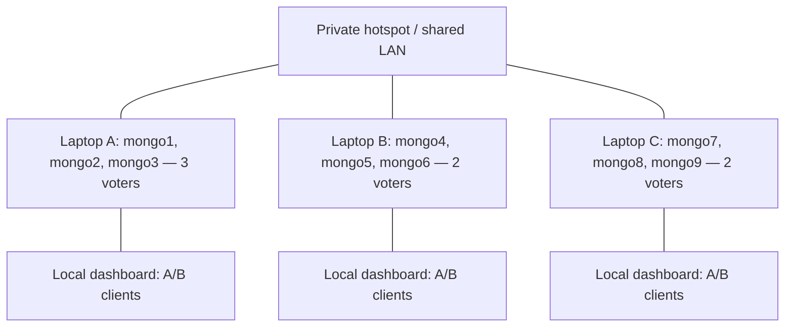

# Plan: three laptops, nine MongoDB nodes, one hotspot

Status: **implemented as a standalone application inside this folder**. All implementation edits are confined to this folder. See [README.md](README.md) for the current setup and operation instructions.

Implemented: disconnected local startup; Connect/Disconnect with cancellation and rollback; owner-specific shared Compose configuration; keyfile and application authentication; coordinator bootstrap; nine-node monitoring and routing; normal shared experiments; local fault controls; separate start/stop launchers; and offline/UI checks.

Changes from this original design: local ports are **28017–28019**, shared ports **29017–29025**, and the dashboard port **8502**. Projects are `mongo-connect-local` and `mongo-connect-shared`; local replica set is `rs-local`. Shared remains `rs-linked`. `scripts/cluster_config.py` holds the fixed inventory and renders a three-service `compose.linked.json` for each owner. Settings and team credentials live under `secrets/`. This avoids conflicts with the original project and avoids maintaining a second inventory file.

Not implemented: remote SSH fault orchestration and TLS. These remain optional extensions under the original plan. Actual three-laptop connectivity, elections, and authentication still require the hardware acceptance test; automated tests mock Docker mutations and linked startup.

The historical design/checklist below is retained for context; its proposed file names, ports, and unchecked boxes are not the current implementation status.

Prepared on 17 September 2026 from the current project source and the official references linked below.

## 1. Intended result and assumptions

Run **one nine-member MongoDB replica set**, with three MongoDB containers on each laptop. All three laptops connect to the same private hotspot. Every member stores a copy of the same data; this is replication, not sharding. Copying the current project to three machines and running the existing launcher would create three independent local labs, not the intended shared cluster.

Assumptions for implementation:

- Start a fresh linked lab with separate Docker volumes. Preserve the existing local lab and its data; merging three existing replica sets is outside this plan.
- Use the same pinned MongoDB image as the project, `mongo:7.0.40`, on all nine nodes. Confirm it runs on each friend's CPU architecture before the meeting.
- Keep the current two-client dashboard on each laptop, bound to localhost. This gives each laptop its own A/B clients and sessions, all accessing the shared database. Nine nodes means nine database servers, not nine users.
- Laptop A coordinates initial setup and formal experiment runs. Each owner starts and manages their own three containers.
- Use normal Docker Compose, published TCP ports, and explicit hostname mappings. No Kubernetes, Swarm, overlay network, or custom remote-control server is needed to connect this cluster.
- The laptop operating systems, available memory, hotspot model, and actual IP addresses are still unknown. Record them before implementation; the current Finder launcher supports macOS only.

I am applying the Ponytail approach: reuse the existing clients, sessions, CRUD operations, logging, and experiment evaluator; change the topology and controls that actually assume one machine.

## 2. Proposed topology and voting arrangement

MongoDB permits up to 50 replica-set members but at most **seven voters**. Nine data-bearing members are valid; nine voters are not. Use seven voting members and two ordinary, visible non-voting secondaries. Non-voters must have `votes: 0` and `priority: 0` and can still serve reads. Sources: [deployment architectures](https://www.mongodb.com/docs/v7.0/core/replica-set-architectures/) and [elections and non-voting members](https://www.mongodb.com/docs/v7.0/core/replica-set-elections/).

Use `rs-linked` for the new replica-set name and `mongo-linked-lab` for the Compose project. These distinguish it from the existing `rs0` / `mongo-local-lab` deployment.

| Laptop | Node / service | Advertised hostname | Internal and published port | Member `_id` | Votes | Priority |
| --- | --- | --- | --- | --- | --- | --- |
| A | mongo1 | mongo1.lab.test | 27017 | 0 | 1 | 1 |
| A | mongo2 | mongo2.lab.test | 27018 | 1 | 1 | 1 |
| A | mongo3 | mongo3.lab.test | 27019 | 2 | 1 | 1 |
| B | mongo4 | mongo4.lab.test | 27020 | 3 | 1 | 1 |
| B | mongo5 | mongo5.lab.test | 27021 | 4 | 1 | 1 |
| B | mongo6 | mongo6.lab.test | 27022 | 5 | 0 | 0 |
| C | mongo7 | mongo7.lab.test | 27023 | 6 | 1 | 1 |
| C | mongo8 | mongo8.lab.test | 27024 | 7 | 1 | 1 |
| C | mongo9 | mongo9.lab.test | 27025 | 8 | 0 | 0 |

Give each member tags such as `{"node":"mongo4","laptop":"B"}`. Existing reads targeted by the `node` tag can then continue to work. No node is permanently the primary.



The following are deductions for this proposed topology, assuming the remaining members are healthy, connected, and sufficiently caught up:

| Event | Remaining voters | Expected availability after election settles |
| --- | --- | --- |
| All laptops running | 7 | One primary, eight secondaries |
| Laptop A lost | 4 | Majority remains; writes can resume |
| Laptop B or C lost | 5 | Majority remains; writes can resume |
| Any two laptops lost | At most 3 | No voting majority; no sustained writable primary |
| Any two individual nodes lost | At least 5 | Majority remains; this is not the old three-node failure case |
| Four voting nodes lost | 3 | No voting majority, even if five total nodes remain |

Election majority is four of seven voters. In this all-data-bearing configuration, `w="majority"` requires acknowledgment from four voting members, including the primary, subject to the journaling setting. It does not wait for five of nine nodes or all nine copies. The two non-voters do not increase that requirement. Source: [MongoDB 7 write concern](https://www.mongodb.com/docs/v7.0/reference/write-concern/).

The hotspot remains a shared failure point. If a participating laptop supplies the hotspot, powering it off also removes the shared network, so that is not an isolated one-laptop database failure.

## 3. Networking that must work before initialization

### Hostnames and ports

Use the advertised hostnames above in the replica-set configuration, rather than localhost, Docker-only short names, or raw hotspot IP addresses. Every client and every member must resolve and reach every advertised endpoint. A successful connection to one seed alone is insufficient: the driver subsequently discovers the other member addresses. MongoDB recommends hostnames for replica-set configuration. [Hostname guidance](https://www.mongodb.com/docs/v7.0/core/replica-set-architectures/#hostnames)

Example host mappings on **all three laptop operating systems**, replacing these illustrative IPs with the actual hotspot addresses:

```text
192.168.43.10 mongo1.lab.test mongo2.lab.test mongo3.lab.test
192.168.43.11 mongo4.lab.test mongo5.lab.test mongo6.lab.test
192.168.43.12 mongo7.lab.test mongo8.lab.test mongo9.lab.test
```

These names intentionally differ from the existing `127.0.0.1 mongo1 mongo2 mongo3` aliases. Do not copy those old localhost mappings into the linked configuration.

Inside Docker, use local network aliases for the three local members and `extra_hosts` mappings for the six remote members. For example, on laptop B:

- `mongo4.lab.test`, `mongo5.lab.test`, and `mongo6.lab.test` resolve through local Docker network aliases to their containers.
- `mongo1.lab.test` through `mongo3.lab.test` map to laptop A's hotspot IP.
- `mongo7.lab.test` through `mongo9.lab.test` map to laptop C's hotspot IP.

Do not override local aliases with `extra_hosts` entries pointing back to the laptop. This avoids depending on container-to-own-host published-port loopback behavior. Keep the internal `mongod` port equal to its advertised/published port. Host OS mappings and container mappings are separate configuration tasks. [Docker network discovery](https://docs.docker.com/compose/how-tos/networking/) and [Compose aliases / extra_hosts](https://docs.docker.com/reference/compose-file/services/)

The three Compose bridge networks stay local to their respective Docker engines. Using the same network name does not join those networks across laptops. Cross-laptop connections use the destination laptop's published ports. [Docker bridge networks](https://docs.docker.com/engine/network/drivers/bridge/)

### Preflight acceptance conditions

- All laptops join the hotspot, and peer-to-peer TCP connections work in both directions. Verify whether the actual hotspot blocks communication between connected devices; joining the same SSID alone does not prove connectivity.
- Publish each laptop's three ports on its hotspot-facing interface, rather than only `127.0.0.1`. Limit inbound access to the participating laptops using the host firewall and verify the effective Docker Desktop / Docker Engine behavior. [Docker port publishing](https://docs.docker.com/engine/network/port-publishing/)
- Check DNS resolution and TCP/MongoDB connectivity from each laptop to all nine endpoints, and from each container to the other eight members. Include same-laptop container connections.
- Check the actual replica-set member list and identity once initialized; a container healthcheck or `ping` alone is not cluster readiness.
- Keep addresses stable during a run, preferably with DHCP reservations if the hotspot supports them. Otherwise update mappings and the Compose environment when addresses change, recreate affected containers without deleting volumes, and rerun preflight.
- Disable laptop sleep during the experiment. Download the image and locked Python dependencies before relying on hotspot internet access.
- Measure available RAM and CPU on each laptop with three containers running. If needed, set explicit container memory limits and a suitable WiredTiger cache size; record chosen values. Do not assume nine processes automatically improve performance.

If the hotspot blocks peer traffic and has no setting to allow it, resolve the network limitation first, for example by using a LAN-capable router/hotspot. Application edits cannot fix an access point that prevents the laptops from communicating.

## 4. Configuration and security changes

Add one small configuration module, proposed as `cluster_config.py`, using standard-library JSON and environment-variable handling. Keep it independent of Streamlit and fault control so there is no `lab.py` / `control.py` import cycle. Make direct script entry points able to import it from the project root using the existing root-path pattern.

Add a versioned `cluster.linked.json` inventory containing the table above: replica-set/project name, node identity, member ID, hostname, port, owning laptop, votes, priority, and tags. Keep current local-mode defaults. Load linked mode explicitly through a setting such as `LAB_CONFIG`; select ownership with `LAB_LAPTOP=A|B|C`. Invalid linked settings must fail clearly instead of silently connecting to the local cluster.

Validate exactly nine unique nodes, three per laptop, unique member IDs/endpoints, seven voters, the planned 3/2/2 voter placement, and priority zero for non-voters. Derive node lists, read routes, seed endpoints, and local node ownership from this inventory.

Provide a non-secret environment example for laptop IPs and local identity. Compose and Python must receive the same exported settings; Python does not automatically read a Compose `.env` file. Preflight should compare the rendered Compose configuration with the inventory to catch duplicated port/hostname mistakes. Do not build a general configuration generator.

Moving from loopback to LAN access also requires access control:

- Configure one shared MongoDB keyfile across all members, mounted with ownership and permissions readable by the container's MongoDB process and restricted as required by MongoDB. Keyfile authentication also enables client access control. Bootstrap once through `mongosh` on a member's loopback interface inside its container, then create the first administrative user on the elected primary. The primary may belong to any laptop, so its owner must perform that local bootstrap step. Do not initialize users independently on all nine nodes. [Keyfile deployment procedure](https://www.mongodb.com/docs/v7.0/tutorial/deploy-replica-set-with-keyfile-access-control/)
- Use an administrative account for setup and a separate application account with `readWrite` on `lab`. If monitoring uses privileged replica-status commands, give its account the necessary monitoring role. Additional database names require explicit grants; document that the dashboard's free-text database field does not grant permission. [MongoDB users and authentication databases](https://www.mongodb.com/docs/v7.0/core/security-users/)
- Supply client credentials separately from the shared seed URI, with explicit `authSource`. Never put secrets in the inventory, committed Compose files, JSONL logs, or distributed example files. Exclude local secret files in `.gitignore` and distribute the actual keyfile/passwords privately.
- Apply credentials consistently to `Actor`, setup checks, topology/status probes, and the standalone baseline. Setup must distinguish authentication failure from an uninitialized set. Review error/command logging so credentials are not recorded.
- Keyfile authentication is not transport encryption. This lab plan assumes a private, trusted hotspot and non-sensitive test data. If that assumption does not hold, add TLS with hostname verification for client and member connections before deployment. [MongoDB TLS configuration](https://www.mongodb.com/docs/v7.0/tutorial/configure-ssl/)

Use the existing Python dependencies; JSON, environment handling, and subprocess control need no new package.

## 5. File-by-file implementation checklist

All entries below describe **future edits**, not work already performed.

### New linked configuration and Compose file

- [ ] Add `cluster_config.py`, `cluster.linked.json`, and a non-secret environment example as described above.
- [ ] Add `compose.linked.yml` with nine explicitly named services, assigned to three profiles: `laptop-a`, `laptop-b`, and `laptop-c`. A selected laptop starts only its three services; do not introduce dependencies that start remote services locally.
- [ ] Use `mongo-linked-lab`, separate named volumes, the shared `rs-linked` name, matching internal/published ports, per-node healthchecks, local aliases, remote hostname mappings, and the keyfile mount.
- [ ] Retain [compose.local.yml](compose.local.yml) for the existing local lab. Stop any conflicting local containers before running linked mode; keep their volumes. The linked plan does not migrate or erase the current data.

### [scripts/lab.py](scripts/lab.py)

Current blockers: `NODES` has three entries, `URI` hardcodes `rs0`, `topology()` probes only `127.0.0.1`, and its worker count is three.

- [ ] Import configured node records, endpoints, replica-set name, and client settings. Update every `NODES` consumer; do not change only the seed URI.
- [ ] Build replica-set-aware application clients with `replicaSet=rs-linked`; retain failover discovery. Restrict `directConnection=true` to individual-node probes/bootstrap.
- [ ] Probe the configured hostname/port for each node with a bounded pool sized for this small inventory. Report laptop owner, endpoint, role, set name, and configured voting status.
- [ ] Verify observed set identity/member inventory through setup/status checks; do not report a node in the wrong replica set as healthy. Distinguish unreachable, unauthorized, and reachable-but-not-ready states.
- [ ] Preserve node tags, `Settings.preference()`, JSON validation, per-actor locks, causal sessions, retry settings, and CRUD behavior.
- [ ] Add the local laptop identifier and a sanitized cluster/config identifier to log records so `A` on one laptop is distinguishable from `A` on another. Keep session IDs and run IDs. Host wall-clock timestamps alone cannot establish causal ordering across laptops.

### [scripts/setup_lab.py](scripts/setup_lab.py) and proposed `scripts/setup_linked.py`

Current blockers: loopback DNS checks, direct local probes, exactly-three-member validation, all-voting assumptions, and starting every service through one local Docker engine. Its migration logic specifically handles the old local lab.

- [ ] Keep the existing local migration path isolated. Add a small dedicated linked setup entry point rather than weakening `validate_config()` to accept arbitrary existing clusters.
- [ ] Provide separate actions for **start local containers**, **preflight/check**, and **initialize shared replica set once**. Friends must not initialize three separate replica sets.
- [ ] All three owners start their local services first. The coordinator verifies the full inventory and initiates the nine-member configuration once using the explicit member IDs, votes, priorities, endpoints, and tags.
- [ ] Bootstrap auth using the container-local procedure above, then use authenticated connections for administrative readiness/configuration checks.
- [ ] Require a stable primary and all eight expected secondaries for full initial readiness, not simply nine ping responses. Confirm the actual config matches the planned inventory and voting arrangement.
- [ ] Make reruns idempotent: existing matching configuration is checked, not reinitiated. Unexpected sets, partially independent sets, or conflicting existing volumes stop with an actionable error. Never automatically force reconfiguration or delete data.
- [ ] Keep bounded timeouts; measure Wi-Fi startup/election/initial-sync time before changing defaults. If tuning is needed, expose a small timeout setting and record its effective value rather than waiting indefinitely.

### [scripts/app.py](scripts/app.py)

Current blockers: the title says three replicas; `zip(st.columns(3), NODES)` would display only three entries even after extending `NODES`; control buttons assume local ownership of the entire cluster.

- [ ] Render all nine nodes in three rows or groups by laptop. Show primary/secondary role, voter/non-voter status, and owning laptop.
- [ ] Populate all nine named read routes from configuration. Retain two independent actors per dashboard process.
- [ ] Clearly identify linked mode and the local laptop. Update startup help so it does not direct linked users into the local `setup_lab.py` path.
- [ ] Allow node control only for locally owned nodes in the first implementation; label remote nodes as controlled by their owner. Distinguish restoring this laptop from restoring the entire cluster.
- [ ] Disable **Clear MongoDB data** in linked mode in both UI and backend. The current button deletes only local volumes and then invokes local three-node setup; it is not a distributed reset.
- [ ] Expose only supported automated experiment scenarios in linked mode. Enforce the restriction in the runner as well as the dropdown.

### [faults/control.py](faults/control.py)

Current blockers: duplicate three-node `NODES`, a fixed local Compose file/project, local-only subprocesses, and exactly-three-volume reset checks.

- [ ] Use configured project/network/service ownership. Local mode must retain its existing label and deletion safeguards.
- [ ] In linked mode, reject mutations targeting another laptop before invoking Docker. A local Docker command cannot stop a friend's container.
- [ ] Retain action allowlists and verify project/service labels. Include profile/local identity in Compose calls, and never interpret untrusted free text as a shell command.
- [ ] Make `restore()` scope explicit: restore this laptop's three members only unless optional remote control is implemented.
- [ ] Reconnect isolated containers with every required alias, including the advertised `mongoN.lab.test` name. Restoring only the current short `--alias node` would leave same-laptop discovery broken.
- [ ] Verify actual network connectivity after isolation/reconnection; Docker attachment state alone does not prove the intended replication partition.
- [ ] Reject linked-mode `clear_data()` even if called directly with `confirmed=True`. A full linked reset requires a separately coordinated procedure across all three owners, preserving logs and handling user/keyfile bootstrap again.

### [scripts/experiments.py](scripts/experiments.py)

Current blockers: `healthy()` requires exactly two secondaries, `apply_scenario()` assumes all targets are locally controllable, and “Two nodes down” expects only one reachable member with no primary. `trial()` and `run_suite()` depend on those functions for start, recovery, and stop decisions.

- [ ] Define full health using the configured inventory: one primary and eight secondaries, expected set identity, and all required members. Keep this separate from majority availability during a fault.
- [ ] First linked release: support `Normal` automated trials; use coordinated manual faults until remote orchestration is available. Reject unsupported scenarios in the runner and do not claim that manual faults were automatically verified.
- [ ] Preserve `evaluate()`, the four histories, causal dependencies, unique documents, and uncertainty/inconclusive handling. The replica count does not require changing those consistency definitions.
- [ ] For future automated fault support, compute availability from configured votes and reachable partitions. “Two nodes down” should normally retain a majority here. Add an explicit “Voting majority lost” case and a “Laptop failure” case if those demonstrations are required.
- [ ] Track exactly which nodes each trial changed and restore those targets in `finally`, including after cancellation. Recovery errors must identify the node and owning laptop and stop further trials.
- [ ] Reserve formal experiments for the coordinator and have friends pause other fault actions/experiment runs. Existing process locks do not coordinate three separate dashboards. A team operating rule suffices initially; a distributed lock is not needed for a supervised lab.
- [ ] Read sampling now visits nine nodes. Measure runtime and retain bounded deadlines; do not interpret slower runs or election timeouts as consistency violations.

### Launcher, baseline, tests, and documentation

- [ ] [Start Lab.command](Start%20Lab.command): keep the local workflow; add an explicit linked launch choice or separate linked launcher. It must load the selected laptop/configuration, start only local containers, and check/join the existing shared set. It must not run initialization on every launch. Provide equivalent terminal steps for friends on other OSes.
- [ ] [.streamlit/config.toml](.streamlit/config.toml): no change required for one local dashboard per laptop. Sharing a single dashboard on port 8501 is optional and would share that process's actors; it does not create clients on the visiting laptop.
- [ ] [scripts/strong_consistency_baseline.py](scripts/strong_consistency_baseline.py): replace its separate hardcoded URI with the same selected configuration and authentication settings. Keep its four demonstration histories.
- [ ] [test.py](test.py): reuse `unittest` and current UI/integration checks. Cover configuration rejection, nine-node readiness/rendering/routes, remote-node control rejection, linked reset rejection, and local-mode compatibility. Update wire-server expectations from short-name/port pairs to configured advertised endpoints.
- [ ] Keep current local migration/reset/launcher tests pinned to local mode; they must not silently adopt the linked inventory. Guard live fault tests against unsupported linked scenarios.
- [ ] [.gitignore](.gitignore): exclude actual environment/credential/keyfile material while retaining safe examples.
- [ ] [README.md](README.md): add a clearly separate linked-lab setup section or link to its runbook; document addresses, ownership, votes, majority behavior, auth, OS-specific startup, failure recovery, and the limits of optional remote automation. Keep the existing local instructions accurate.
- [ ] [pyproject.toml](pyproject.toml) and `uv.lock`: no dependency change is expected.

## 6. Optional remote fault automation

This is not required to form the nine-node cluster. Initially each friend can use their local dashboard or terminal to stop/start their own nodes while the coordinator observes the cluster.

If one dashboard must control all nine nodes and run the complete fault suite unattended, add authenticated SSH dispatch to each owner's existing bounded control CLI. Keep destinations, project paths, actions, and node names allowlisted; verify host keys; use bounded timeouts; capture structured results. Do not expose an unauthenticated Docker TCP socket or add a network shell service.

Account for differing project paths and OS shells. Ensure a failed/partial multi-laptop operation records completed targets and attempts recovery only where needed. A laptop that is powered off cannot be restarted through the same unavailable SSH connection; that remains an owner recovery action. Losing the coordinator also removes the automation process, so every owner still needs a local restore command.

Before enabling automated partition scenarios, establish the actual reachability matrix during faults. Isolating one container, stopping three containers, disconnecting a laptop from Wi-Fi, and turning off the hotspot are different failures and must be named separately.

## 7. Implementation order and handoff procedure

### Implementation order

1. Add inventory/configuration and validation; keep existing local behavior passing.
2. Add linked Compose services, addressing, keyfile/user bootstrap, and local ownership. Test connectivity before calling `rs.initiate()`.
3. Add one-time initialization and authenticated cluster checks.
4. Wire configuration into clients, topology, the dashboard, and baseline. Gate unsafe/unsupported linked controls before exposing them.
5. Adapt normal experiment health checks and existing tests; verify writes/reads across laptops.
6. Document owner-controlled failure/recovery and complete the physical-laptop acceptance checks below.
7. Add SSH-driven fault automation only if the team requires unattended distributed fault trials.

### What to send to each friend after implementation

Share the same source revision, inventory, Compose configuration, dependency lockfile, and runbook. Do not copy `.venv`, Python caches, existing Docker database volumes, or previous `results` as installation inputs. Send each friend their laptop identity and local environment values. Transfer secrets separately. Each friend creates their own Python environment and local database volumes.

### First shared startup after implementation

1. Agree on laptop A/B/C, actual IP addresses, hotspot ownership, and test duration. Record the OS/architecture and confirm image/dependency installation.
2. Configure the hostname mappings on hosts and containers, firewall access, and credentials/keyfile material. Check that local and linked deployments are not competing for ports.
3. Each owner starts only their three linked containers with the assigned profile.
4. Run preflight from all owners; confirm host and container reachability to the advertised endpoints.
5. The coordinator initiates the one shared replica set once. The owner of the elected primary completes first-user bootstrap locally, then administrative/application access is verified.
6. Verify nine configured members, seven voters, two priority-zero non-voters, one primary, and eight secondaries.
7. Start each local dashboard against the linked inventory. All dashboards should observe the same set and primary after discovery settles.
8. Write a unique test document on laptop A, read it on B and C, and deliberately target each of the nine nodes. Independent laptop sessions do not automatically inherit A's causal history; wait/retry observations within a deadline when checking replication.
9. Run coordinator-led normal experiments. Add manual failure demonstrations only after healthy baseline and local recovery have been verified.

These are intended workflow steps, not commands currently implemented by the repository. Exact command lines and OS-specific host-file/firewall instructions should be added alongside implementation.

## 8. Acceptance checks before calling the linked lab complete

| Check | Required evidence |
| --- | --- |
| Original local lab | Existing offline/UI checks pass; local launcher and three-node mode still work |
| Network | Every host reaches all nine endpoints; every container reaches all other members |
| Identity | Config/status agree on `rs-linked`, all nine member IDs/endpoints/tags, and the 3/2/2 vote distribution |
| Authentication | App user can read/write `lab`; unauthenticated CRUD is rejected; secrets absent from evidence files |
| Discovery | Clients discover the entire set; changing primary does not require manually replacing the seed URI |
| UI | All nine members displayed and selectable; owning laptop and non-voters clearly identified |
| Shared data | Insert/update/replace issued from different laptops affect the same uniquely identified document |
| Replication | A tagged read from each of the nine nodes eventually observes an acknowledged test write |
| Sessions | A/B sessions remain independent within each dashboard and distinct across laptops |
| Non-voters | Both can serve tagged reads and neither is eligible to become primary |
| One laptop lost | Test each owner separately, restoring full health between tests; remaining laptops retain a majority and eventually accept a majority write |
| Two laptops lost | No sustained writable primary after election/heartbeat detection; failures recorded as availability outcomes |
| Recovery | Restore stopped nodes and hostname aliases; all nine rejoin without deleting volumes |
| Safety of scope | A local node-control request cannot operate on another owner's service or another Compose project; linked volume reset is blocked |
| Logs | Laptop/config/run/session identifiers make histories attributable; no claim of total order from wall-clock timestamps |
| Repeat startup | Normal restarts preserve documents and configuration; no duplicate initialization or recreated users |

Test laptop failures by stopping that owner's three database containers first. This preserves the hotspot and the observing clients, and isolates the database failure from unrelated network or dashboard failure. Later physical power/Wi-Fi tests should state exactly what else stopped.

No deployment or live fault tests were run while writing this plan. The implementation is complete only after the real hotspot and all three laptops pass the checks above.
